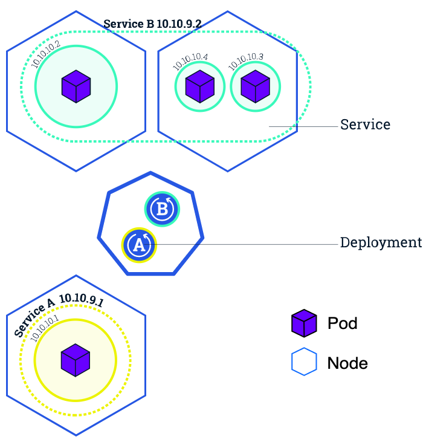

=== Kubernetes architecture

image::images/k8s/k8s-architecture.png[]

=== Kubernetes architecture: the nodes

The nodes executing our containers run a collection of services:

* a container Engine (typically Docker)
* kubelet (the "node agent")
* kube-proxy (a necessary but not sufficient network component)

=== Kubernetes architecture: the control plane

* The Kubernetes logic (its "brains") is a collection of services:
** the API server (our point of entry to everything!)
** core services like the scheduler and controller manager
** etcd (a highly available key/value store; the "database" of Kubernetes)
* Together, these services form the control plane of our cluster
* The control plane is also called the "master"
* Usually on a separate node (invisible on GKE)

=== Everything is a resource...

* Resources are organized by type or `Kind` such as:
** node (a machine in our cluster)
** pod (group of containers sharing the same context)
** service (network endpoint to connect to containers)
** namespace (group of things)
** secret (sentitive data used by a container)
** ... and much more !

=== Everything is a resource...

Wanna be scared ?

```shell
kubectl api-resources
```

=== Everything is a **YAML** resource...

```yml
apiVersion: extensions/v1beta1
kind: Deployment
metadata:
  labels:
    run: python
  name: python
  namespace: default
spec:
  replicas: 1
  selector:
    matchLabels:
      run: python
  strategy:
    rollingUpdate:
      maxSurge: 1
      maxUnavailable: 1
    type: RollingUpdate
  template:
    metadata:
      labels:
        run: python
    spec:
      containers:
      - image: eu.gcr.io/tcife2-sandbox-ato/test-server
        imagePullPolicy: Always
        name: python
        resources: {}
        terminationMessagePath: /dev/termination-log
        terminationMessagePolicy: File
        volumeMounts:
          - name: kubernetes-api-account-credentials
            readOnly: true
            mountPath: "/etc/kubernetes-api-account-credentials"
          - name: service-account
            readOnly: true
            mountPath: "/tmp/service-account-credentials"
      dnsPolicy: ClusterFirst
      restartPolicy: Always
      schedulerName: default-scheduler
      securityContext: {}
      terminationGracePeriodSeconds: 30
      serviceAccount: kubepingsa
      serviceAccountName: kubepingsa
      volumes:
      - name: kubernetes-api-account-credentials
        secret:
          secretName: kubernetes-api-account-credentials
      - name: service-account
        secret:
          secretName: kubepingsa-token-t7nkr
```

=== Declarative style

* The `spec` describes **how we want the thing to be**
* Kubernetes will **reconcile** the current state with the spec
* When we want to change some resource, we update the spec
* Kubernetes will then **converge** that resource

=== A typical pattern

