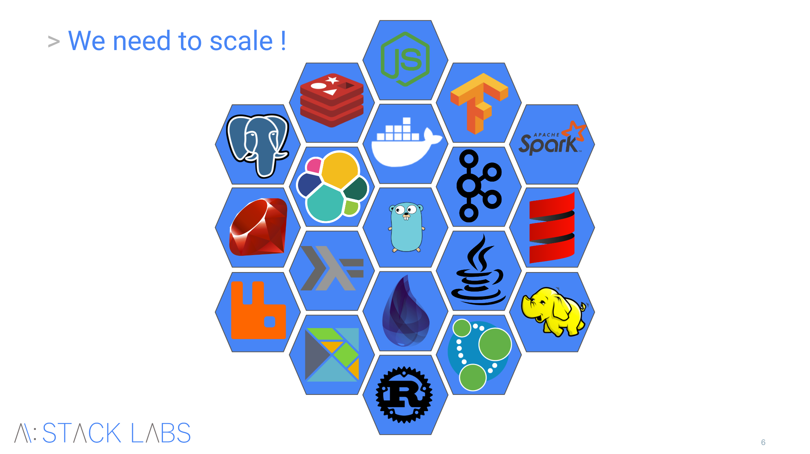

== Kubernetes

[%notitle]
=== We need to scale !

=== We need to scale !

* How do we scale ?
* Very diverse payloads (languages, technologies, MVP, POCs)
* Elasticity
* On Prem / Public cloud
* Maximize cluster usage / Pay as you go
* Standard and developer friendly
* No infrastructure management !
* Cloud Native

=== Concepts

[%step]
* Kubernetes is a container management system
* It runs and manages containerized applications on a cluster
* It is technology agnostic

=== What can Kubernetes do ?

* Scale containers and do autoscaling
* Handle internal and external load balancers
* Run smooth version upgrades
* Run services with sateful data
* Fine-grained access control
* Secret management

=== What about GKE ?

* A managed Kubernetes : don't have to install anything !
* Scaling : to infinity and beyond
* Automatic upgrades
* Integrates very well with GCP platform:
** Network (VPN, security, etc)
** Logging & Monitoring
** GCP or third-party products

=== A little history...

* Open Source
* Initiated by Joe Beda @Google
* First release in 2015
* CNCF (Google, Linux Foundation, Microsoft)

=== Practice time !

Setup Kubernetes cluster on GKE

=== Kubernetes on GKE

One command for cluster creation: pretty easy, right ?