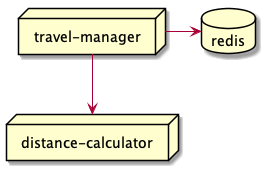

=== Resources: Pods

[%step]
* Smallest logical unit in kubernetes
* Group of containers running on the same node.
* Each pod is assigned a unique IP.
* Containers can talk to each other through ‘localhost’.
* Assigned to cluster nodes by the Kubernetes Scheduler.

=== Workshop microservices architecture

=== Practice time !

Create and manage Pods
