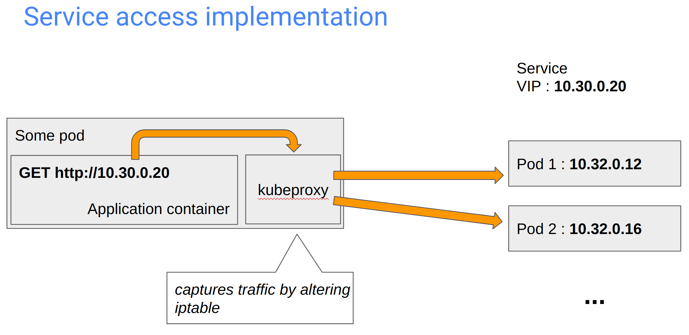
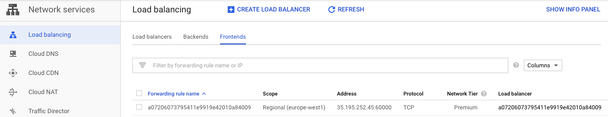

=== Resources: Services

* Simple access to replicated pods.
* A unique VIP by service. Routing and load balancing from the cluster.
* DNS entries and env vars are created to ease access to services.
* ClusterIP, NodePort, LoadBalancer (public IP).
* Under the cover, ‘kubeproxy’ works with iptables and ipvs.

[%notitle]
=== K8S service access implementation

=== Practice time !

Add services to access your microservices

=== K8S services

* Easy to create
* ClusterIP, NodePort, LoadBalancer

=== GKE auto-magic

=== Services levels

LoadBalancer > NodePort > ClusterIP > Container port

=== Practice time !

Play with auto-scaling !