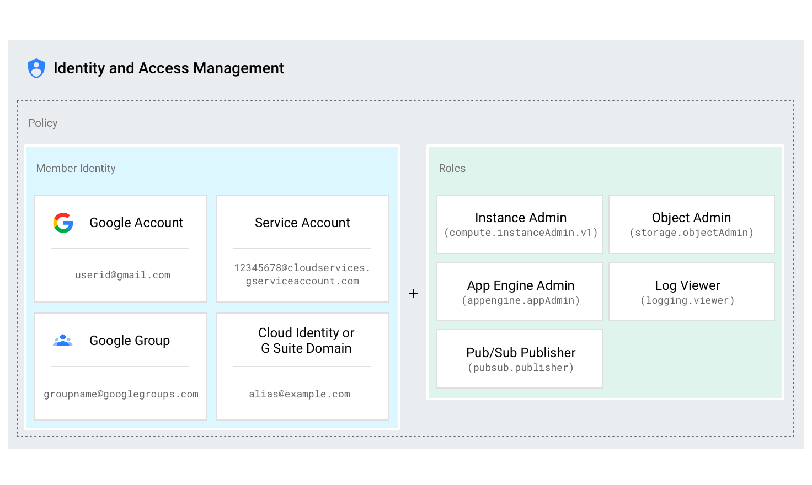
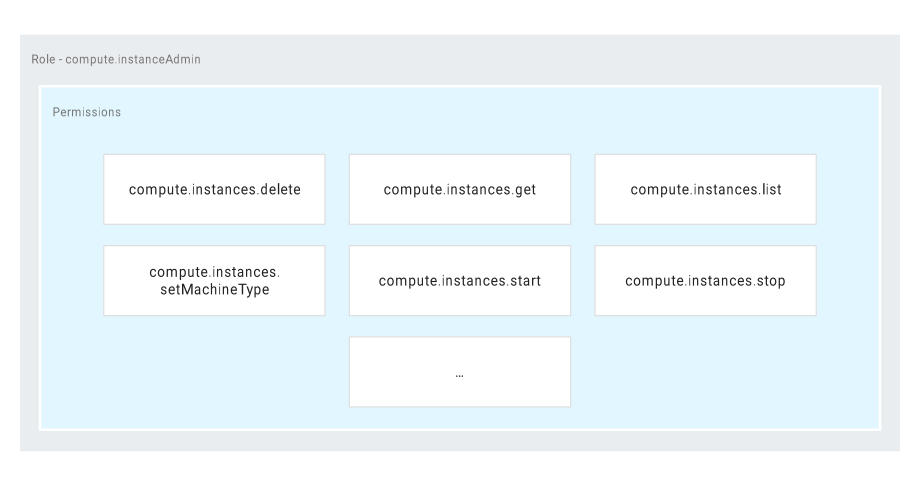
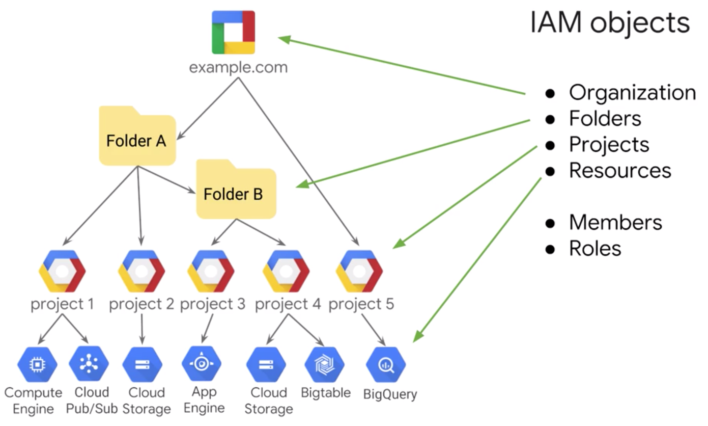
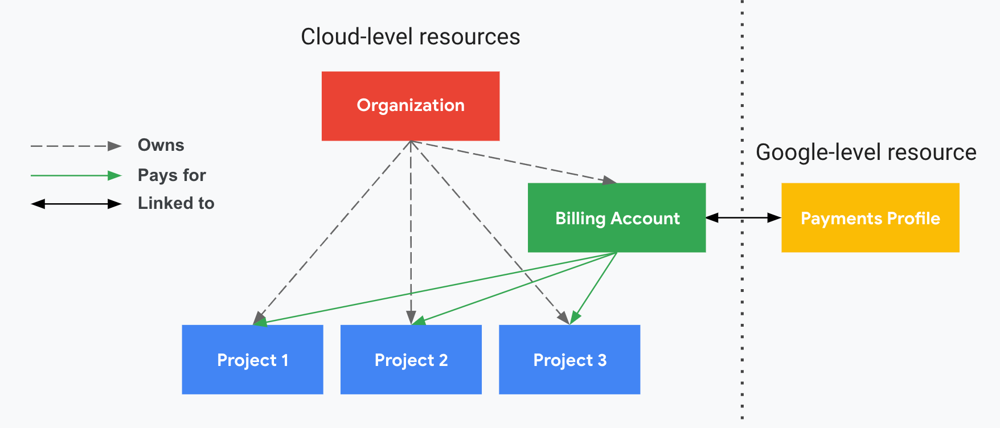

== GCP basics

=== IAM: Identity and Access Management

**Who** > Can do **what** > on **which** resource

Identity > Role > Resource

[%notitle]
=== IAM: Identity and Access Management

=== IAM: Identity

* Google account
* Service account
* Google group
* G Suite domain
* Cloud Identity domain

=== IAM: Roles

|===
|Role type |Example |Scope

|Primitive Roles
|Owner / Editor / Viewer
|Project-wise

|Predefined Roles
|Redis Admin / Redis Editor / Redis Viewer
|Resource

|Custom Roles
|CI admin
|Multiple Resources
|===

[%notitle]
=== IAM: Roles

=== IAM: Roles

* Roles are concentric
* Principle of Least Privilege
* Prefer group to single users
* What out for new permissions

=== IAM: Organization roles

* Organization admin
* Project Creator

[%notitle]
=== IAM: Objects & Resources

[%notitle]
=== IAM: Objects Hierarchy

image::images/gcp-basics/policy-hierarchy.png[background, size=contain]

=== IAM: Objects Hierarchy

⚠︎ Child policies cannot restrict higher-level policies !

Again: Principle of Least Privilege

=== Service accounts

* Behave like a standard user account
* Used to calls APIs or services from apps or VMs
* Have service accounts keys
* Can be short or long-lived

=== Billing account

=== Demo time !

How to manipulate roles