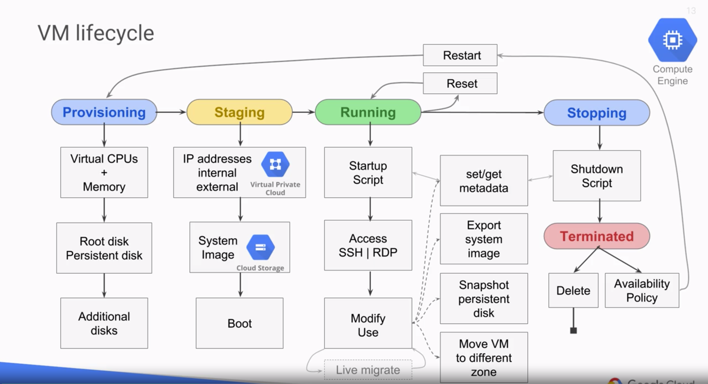

=== Google Compute Engine

Infrastructure as a Service (IaaS)

=== Google Compute Engine

Everything is configurable:

* vCPUs and Memory
* Persistent disks: HDD, SSD, Local SSD
* Networking
* OS

=== GCE: Networking

* Throughput of 2Gb per vCPU
* Max throughput of 16Gb (8 vCPU)

=== GCE: Storage

Persistent disks:

* Standard, SSD or local SSD
* Standard & SSD can scale up to 64TB
* Can be hot-resized
* Local SSDs have higher throughput and lower latency, but 💵💵
* Local SSDs only persists while VM is alive
* Local SSDs have a max capacity of 3TB

=== GCE: Pricing

* Billing is per-second, 1 minute minimum
* Preemptible instances:
** are cheaper (up to 80% discount)
** can be killed any time by Google
** live at most 24h

=== GCE: Pricing

Other discount types:

* Sustained use discounts (> 25% of month)
* Committed use discounts
* Free quota (1 `f1-micro` per month)

[%notitle]
=== GCE: VM Lifecycle

=== GCE: Running vs Stopped

* Live updates:
** Snapshot image/disk
** Move to different zones
* Needs to beed stopped:
** Upgrading VM type
** Add/Remove attached disks

=== GCE: Stopped VMs

Beware the attached disks and IPs !

💵💵💵

=== GCE: Availability Policy

Defines what to do on:

* Crashes: automatic restart ?
* Host maintenance: live-migrated or terminated ?

-> Live migration by default

=== Practice time !

Create and manage compute instances