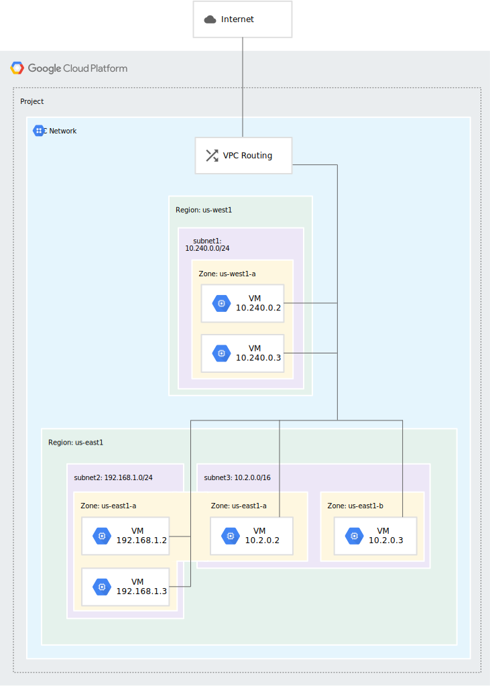
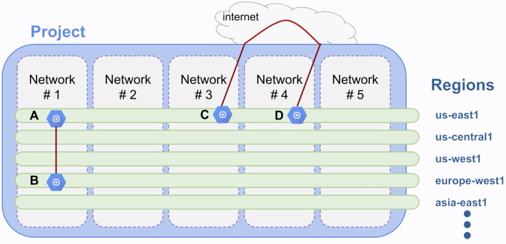
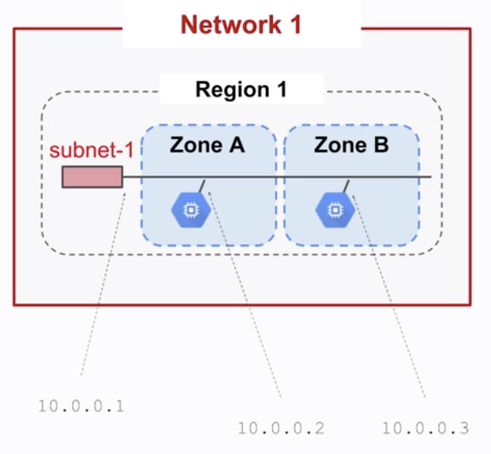
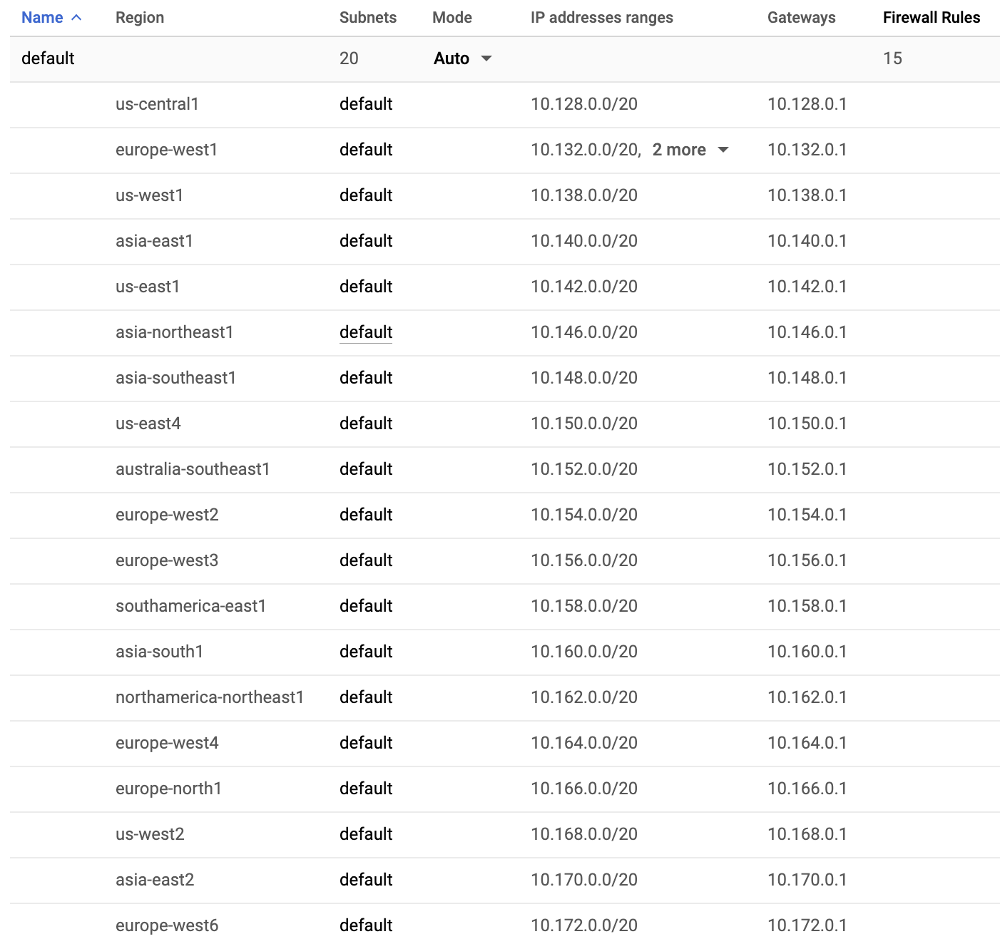
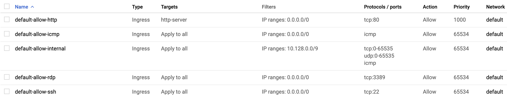
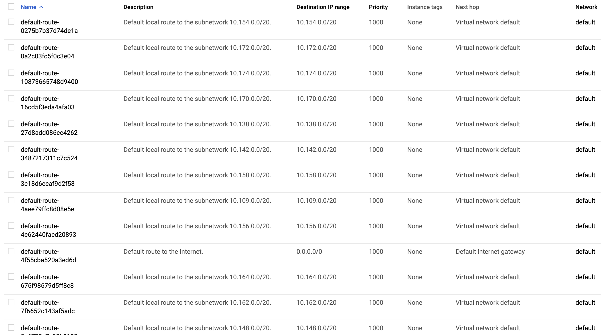

=== Virtual Private Cloud

* Similar to a physical network
* VPCs are isolated from each other
* Global, i.e. multi-regional

=== VPC: Different objects

* Projects
* Networks
* Subnetworks
* Regions
* Zones

[%notitle]
=== Virtual Private Cloud

=== VPC: Different modes

* Default
* Auto mode
* Custom mode

=== VPC: Networks isolate systems

=== VPC: Subnetworks cross zones

=== VPC: The default network

* Used for all resources by default
* Contains a subnet for each GCP zone

[%notitle]
=== VPC: The default network

=== VPC: Firewall rules

> Which packets are allowed to travel to which destination

* 1 virtual firewall per VPC
* By default:
** Block all incoming traffic
** Allow all outgoing traffic
** ... even internal traffic !

=== VPC: Default network firewall rules

* Allows internal traffic
* Allows SSH, HTTP connections, etc.

[%notitle]
=== VPC: Default network firewall rules

=== VPC: Routes

> How to send packets **from** an instance to a destination

* To another resource inside the network
* To the outside of GCP

=== VPC: Default network routes

* Subnet to subnet routes
* Subnet to internet routes

[%notitle]
=== VPC: Default network routes

=== VPC: Forwarding rules

> How to forward packets **to** a GCP resource

* From outside GCP: external LB
* From another resource: internal LB

=== Practice time !

Create a new VPC network